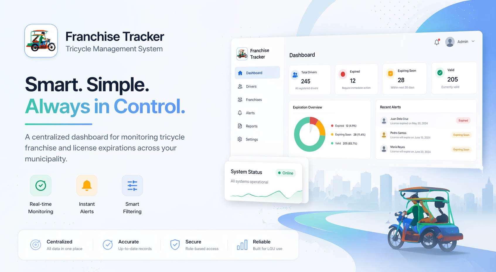
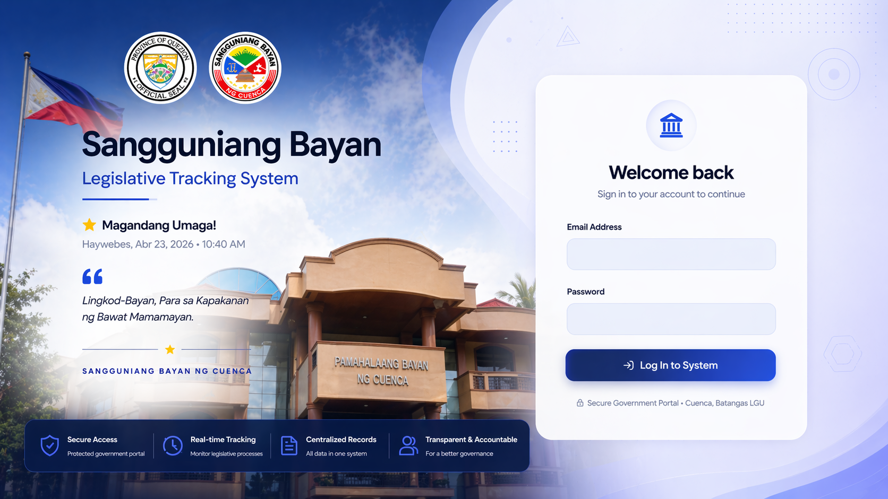
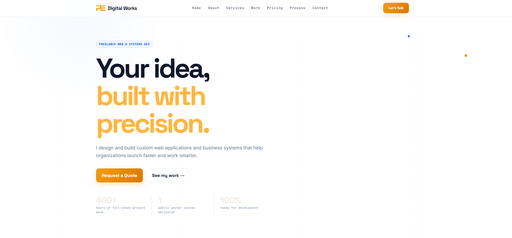
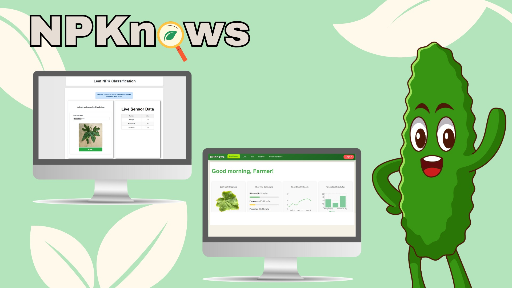
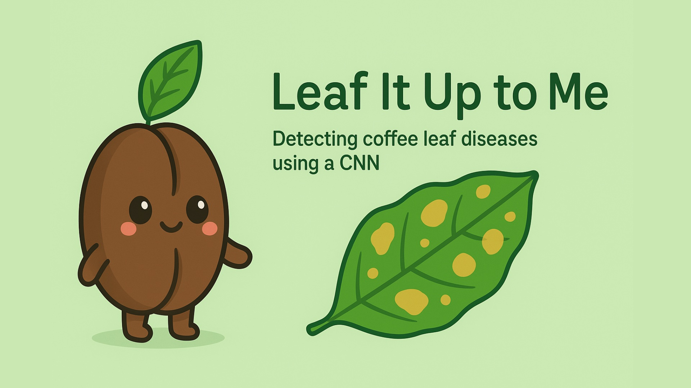
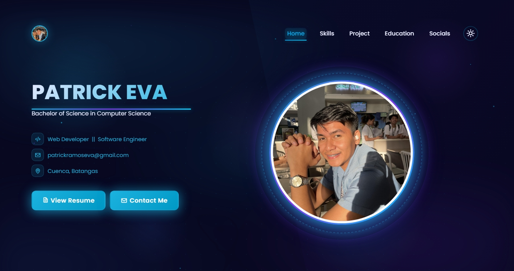

# Patrick Eva

**Software Engineer · Full-Stack Web Developer · CS Student**

📍 Cuenca, Batangas, Philippines &nbsp;|&nbsp; 🌏 Open to Remote / Hybrid / On-site

---

## About Me

- 🎓 BS Computer Science graduate at National University
- 💻 Focused on React, Django, and AI/ML
- 🚀 Building full-stack applications and exploring system design
- 🌱 Currently sharpening skills in clean architecture and scalable systems

---

## Tech Stack

**Languages:** Python, JavaScript, PHP, C++, HTML5, CSS3

**Frontend:** React, Tailwind CSS, Vite

**Backend & Frameworks:** Django, Node.js, Express

**Databases & Cloud:** MySQL, Firebase, Supabase, Vercel

**AI / ML:** TensorFlow, Keras, NumPy, Pandas

**Tools:** Git, GitHub, VS Code, Figma, Postman, Notion

---

## Featured Projects

### 🚖 Tricycle Franchise Tracker

Real-time driver franchise and license monitoring system for LGU operations.
`PHP` `MySQL` `JavaScript`
[Repo](https://github.com/patrickeva/Tric-Franchise-Tracker) · [Live Demo](https://tric-franchise-tracker.vercel.app/)

 

### 📜 Cuenca Legislative Tracker

Digital platform for tracking ordinances and resolutions with secure cloud storage.
`React` `Firebase` `Supabase` `JavaScript`
[Repo](https://github.com/patrickeva/sb-cuenca-docsys) · [Live Demo](https://sb-cuenca-docsys.vercel.app/login)

 

### 💼 Digital Works

Freelance web and systems development portfolio site — showcasing custom web applications and business systems built for clients.
`React` `JavaScript` `CSS3`
[Repo](https://github.com/patrickeva/patrick-FWeb) · [Live Demo](https://patrick-f-web.vercel.app/)

 

### 🌱 NPK Deficiency Detector

CNN-based classifier for identifying nutrient deficiencies in bitter gourd plants, integrated with IoT hardware.
`Python` `TensorFlow` `IoT` `CNN`
[Repo](https://github.com/itzjmbruhhh/NPK_Deficiency_Classifier_IoT) · [Live Demo](https://npknows.vercel.app/)

 

### ☕ Leaf It Up to Me

Coffee leaf disease detector built on a MobileNetV2 CNN architecture.
`Python` `TensorFlow` `MobileNetV2`
[Repo](https://github.com/itzjmbruhhh/coffee_leaf_diseases_classifier)

 

### 🎓 Personal Portfolio

Personal portfolio website showcasing projects and engineering experience.
`React` `CSS3` `HTML5` `JavaScript`
[Repo](https://github.com/patrickeva/ptrk_portfolio) · [Live Demo](https://ptrkportfolio.vercel.app/)

 

### 🎓 NU Lipa Admission System

Django-based student admission system with planned ML integration for decision support.
`Django` `Python` `JavaScript` `TensorFlow`
[Repo](https://github.com/itzjmbruhhh/NU_Admission)

[Browse All Repositories →](https://github.com/patrickeva?tab=repositories)

---

## GitHub Stats

---

## Contact

Open to collaboration, job opportunities, or a good tech conversation — feel free to reach out through any of the links above.
