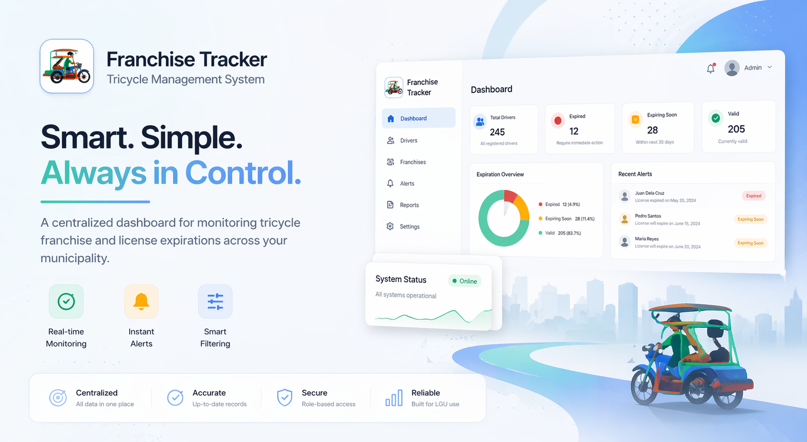
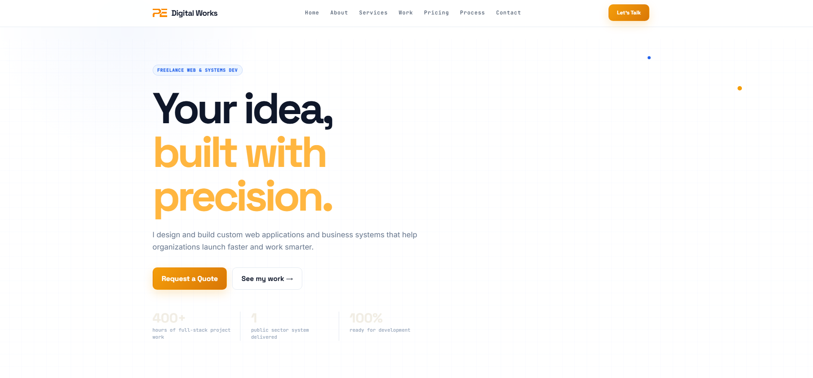
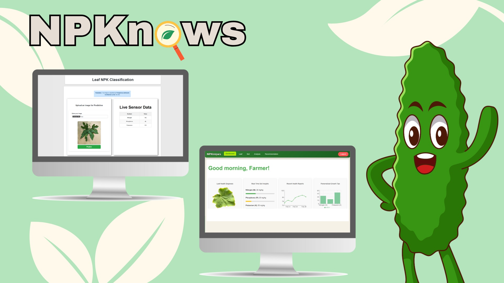
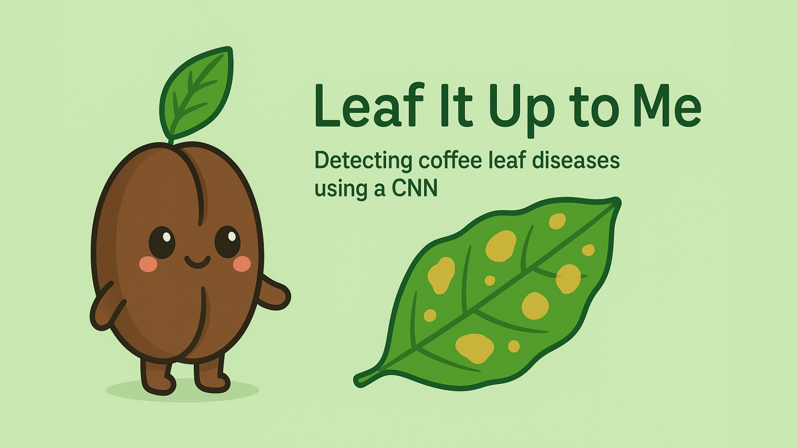
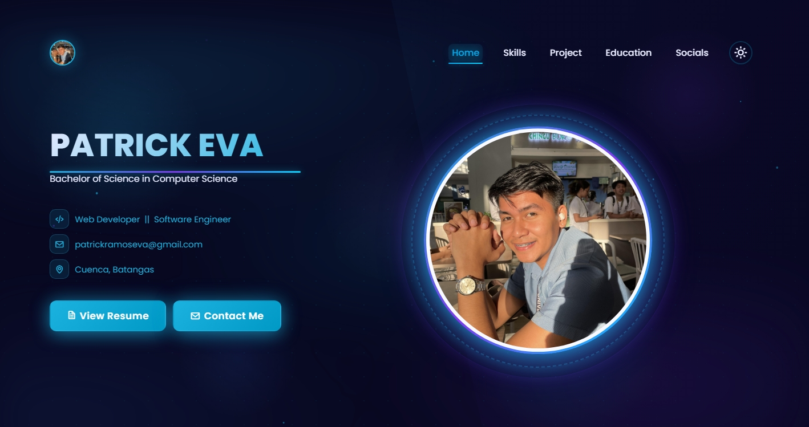

# Patrick Eva

###  Web & System Developer

Building practical web applications and reliable systems that solve real-world problems.

📍 Cuenca, Batangas, Philippines   •   🌏 Open to Remote · Hybrid · On-site

---

## 👨‍💻 About Me

I'm a **Computer Science graduate focused on web development and system development**, with experience building practical applications for business, organizational, and local government use.

I enjoy developing complete systems — from designing responsive user interfaces and building frontend applications to developing backend functionality, databases, APIs, and system workflows.

* 🎓 **BS Computer Science Graduate** — National University - Lipa
* 💻 Focused on  Web & System Development
* 🖥️ Experienced in developing **Business & Management Systems**
* ⚙️ Interested in **Backend Development & System Architecture**
* 🗄️ Experienced with **MySQL, PostgreSQL, Firebase & Supabase**
* 📱 Built **real-time GPS tracking** with a native Android driver app
* 🎨 Interested in **UI/UX and modern responsive interfaces**
* 🔧 Comfortable working with **Git, GitHub, APIs, and deployment platforms**
* 🌱 Continuously improving my skills in **software engineering and system development**

> **My goal is to build reliable, practical, and user-friendly systems that solve real-world problems.**

---

# 🛠️ Tech Stack

### 💻 Programming Languages

### 🌐 Frontend Development

### 📱 Mobile Development

### ⚙️ Backend & System Development

### 🗄️ Database & Cloud

### 🎨 UI/UX & Design

### 🔧 Development Tools

### 🤖 AI / Machine Learning — Familiarity

> Explored machine learning and CNN-based projects through academic and personal development projects.

---

# 🚀 Featured Projects

My projects primarily focus on **web development, system development, database-driven applications, and practical software solutions**.

 

<table>
<tr>
<td colspan="2" align="center">

## 🚌 BMTC Minibus Tracker

**Fleet Management System · Real-Time GPS Tracking**

A real-time GPS fleet tracking system for a transport cooperative operating the **SM Lemery ↔ SM Lipa** route. 
Passengers follow live minibus locations on a public map — no app or sign-up required — 
while drivers use a native Android app that keeps transmitting even with the screen off.

<table>
<tr>
<td align="center">📍 <b>Live GPS Map</b> Real-time bus positions</td>
<td align="center">📱 <b>Native Driver App</b> Background tracking</td>
<td align="center">🛣️ <b>Route Progress</b> Trip % per unit</td>
<td align="center">🌙 <b>Street · Satellite · Dark</b> Map & theme toggles</td>
</tr>
</table>

</td>
</tr>
</table>

 

### 🖥️ Web & System Development

<table>
<tr>

<td width="50%" valign="top">

### 📜 Cuenca Legislative Tracker

**Legislative Document Management System**

A digital platform for managing ordinances, resolutions, and legislative documents with cloud-based data storage.

</td>

<td width="50%" valign="top">

### 🚖 Tricycle Franchise Tracker

**Web-based LGU Management System**

Manages and monitors tricycle franchise records, driver information, licenses, and operational data.

</td>

</tr>
<tr>

<td width="50%" valign="top">

### 💼 Digital Works

**Web & System Development Portfolio**

Showcases websites, custom web applications, and business systems created for clients and organizations.

</td>

<td width="50%" valign="top">

### 🎓 NU Lipa Admission System

**Student Admission Management System**

A Django-based platform that streamlines student application and admission workflows.

</td>

</tr>
</table>

 

### 🤖 Machine Learning

<table>
<tr>

<td width="50%" valign="top">

### 🌱 NPK Deficiency Detector

**Machine Learning / IoT Project**

Image classification for identifying nutrient deficiencies in bitter gourd leaves.

</td>

<td width="50%" valign="top">

### ☕ Leaf It Up to Me

**Coffee Leaf Disease Classification**

CNN-based classification of coffee leaf diseases using MobileNetV2.

</td>

</tr>
</table>

 

---

# 🌐 Personal Portfolio

 

### Explore My Portfolio

A personal website showcasing my **projects, technical skills, experience, and development journey**.

 

---

# 📊 GitHub Statistics

<table>
<tr>

<td width="50%" align="center">

### 📈 GitHub Stats

</td>

<td width="50%" align="center">

### 💻 Top Languages

</td>

</tr>
</table>

 

### 🔥 GitHub Streak

  

---

# 💡 What I Enjoy Building

| Area                       | Focus                                                  |
| -------------------------- | ------------------------------------------------------ |
| 🌐 **Web Development**     | Responsive and modern web applications                 |
| 🖥️ **System Development** | Business, management, and organizational systems       |
| ⚙️ **Backend Development** | APIs, authentication, databases, and application logic |
| 📍 **Real-Time Systems**   | Live GPS tracking and fleet monitoring                 |
| 🗄️ **Database Systems**   | MySQL, PostgreSQL, Firebase, and Supabase              |
| 🎨 **UI/UX**               | Clean, responsive, and user-friendly interfaces        |
| 🚀 **Deployment**          | GitHub, Vercel, Cloudflare Pages, and cloud platforms  |

---

# 🤝 Let's Connect

I'm open to **software engineering opportunities, web development projects, system development work, collaboration, and freelance opportunities.**

 

  

**Thanks for visiting my profile! 👋**

---

Designed & developed by <strong>Patrick Eva</strong>

